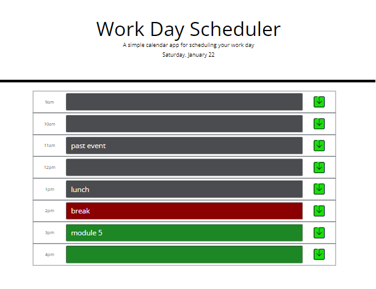

# Day Scheduler

Schedule your day at [https://nitrotap.github.io/day-scheduler/](https://nitrotap.github.io/day-scheduler/)

Day Scheduler uses Bootstrap and jQuery to function as a single day scheduler. Click on any time slot to edit or add a task. Click on the green icon to save your task into localStorage.

